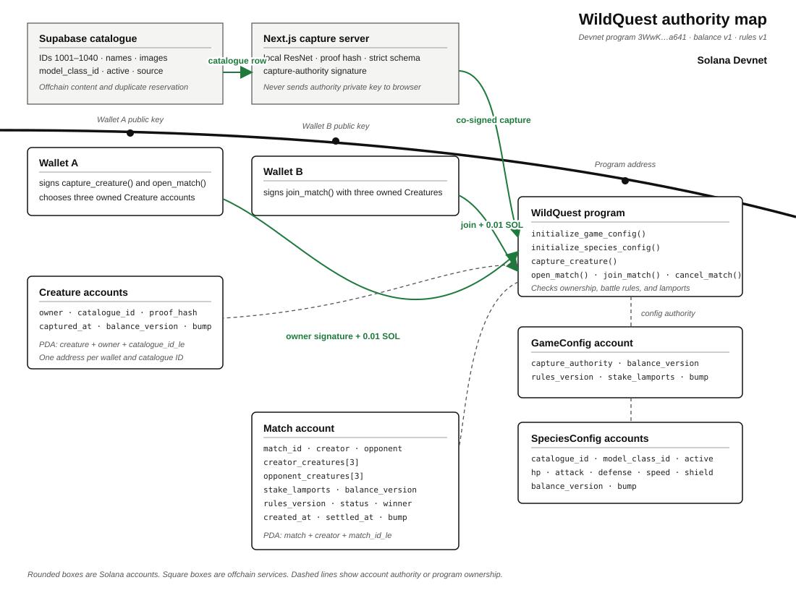

# Vertical Slice Authority and Account Contract

## One program ID anchors every address

The vertical slice uses Devnet program ID
`3WwKscJzw5CapS5Y1Pq2ebjdGxfCEcVs6Z6dJNuxVzqF`.

The Rust `declare_id!`, both Anchor cluster entries, the IDL address, the Codama client, PDA helpers, and browser transaction builders must use that address. `DzUrGjvWMzp8m3Vs6jb8F7xfoh96W5Jmad9GBLgCAgvo` remains an older deployed Discovery program and is not part of the battle slice.



## Each participant controls a narrow set of facts

### Supabase controls catalogue content

Supabase owns these fields for each of the 40 supported catalogue rows:

- `id`: positive numeric catalogue ID, reserved as `1001` through `1006`
- `species_id`: stable offchain slug
- `name`
- `scientific_name`
- `description`
- `image_url`
- `source_url`
- `is_active`
- `model_class_id`: exact ImageNet class ID

The catalogue migrations insert IDs `1001` through `1040` explicitly and
advance the table sequence beyond `1040`. Supabase never decides ownership,
battle stats, a Match outcome, or a payout.

### The Next.js server controls capture authorization

The server runs local ResNet inference, validates its strict response, joins the result to one active catalogue row, creates the SHA-256 proof, and reserves the duplicate-image hash. The server keeps the capture-authority key in a server-only environment secret.

The server prepares the `capture_creature()` transaction and signs it as the configured capture authority. The browser receives a partially signed transaction. The browser never receives the capture-authority private key.

### The wallet controls player actions

The owner wallet signs `capture_creature()` and `open_match()`. The opponent wallet signs `join_match()`. The Match creator signs `cancel_match()`.

A wallet chooses its three owned Creature accounts and their visible order. It cannot choose stats, a battle result, a payout, or an arbitrary catalogue ID that the server did not authorize.

### The Solana program controls game state and SOL

The program checks both capture signers, derives every PDA, validates Creature ownership, reads versioned stats, runs deterministic combat, stores the Match outcome, and moves integer lamports. Failed instructions roll back every account change.

## The capture API grows in two explicit stages

`POST /api/identify` accepts `multipart/form-data` with exactly one `wallet` string and one `image` file. The current JPEG, PNG, WebP, and 4,000,000-byte limits remain.

Day 2 returns a strict identification candidate containing the catalogue ID,
exact ImageNet class and label, confidence, proof hash, and balance version. It
does not claim that the wallet can create a Creature yet.

Day 3 extends that successful response with a claimable action after
`capture_creature()` exists. The complete vertical-slice response then has two
strict objects and no extra fields:

```json
{
  "identification": {
    "catalogue_id": "1002",
    "species_id": "golden_retriever",
    "model_class_id": 207,
    "common_name": "Golden Retriever",
    "model_label": "golden retriever",
    "confidence": 0.93,
    "proof_hash": "64-character-lowercase-sha256-hex",
    "balance_version": 1,
    "capture_enabled": true
  },
  "capture_transaction": {
    "program_id": "3WwKscJzw5CapS5Y1Pq2ebjdGxfCEcVs6Z6dJNuxVzqF",
    "transaction_base64": "partially-signed-versioned-transaction",
    "last_valid_block_height": "decimal-string"
  }
}
```

The partially signed transaction contains the same wallet, catalogue ID, proof hash, and balance version shown in `identification`. The wallet signs the transaction without rebuilding its instruction. Returning a placeholder or unsigned transaction before Day 3 is prohibited.

The existing upload, unsupported-species, low-confidence, duplicate-image, and unavailable-service errors remain. The server adds `CAPTURE_AUTHORIZATION_UNAVAILABLE` when it cannot build and co-sign a valid transaction. No error response contains a claimable transaction.

## GameConfig stores global authority and stake rules

The program derives the GameConfig PDA from `[b"game_config"]`. Its account stores:

- `admin: Pubkey`
- `capture_authority: Pubkey`
- `balance_version: u16`
- `rules_version: u16`
- `stake_lamports: u64`
- `bump: u8`

`initialize_game_config()` requires the admin signer and stores `stake_lamports = 10_000_000`, `balance_version = 1`, and the current rules version. Existing deployments use the admin-only `activate_turn_combat()` instruction to move `GameConfig` to simultaneous-turn rules version 2 without deleting the PDA account.

## SpeciesConfig stores authoritative battle stats

The program derives each SpeciesConfig PDA from
`[b"species_config", catalogue_id.to_le_bytes().as_ref(), balance_version.to_le_bytes().as_ref()]`.

Its account stores:

- `catalogue_id: u64`
- `model_class_id: u16`
- `hp: u16`
- `attack: u16`
- `defense: u16`
- `speed: u16`
- `shield: u16`
- `balance_version: u16`
- `active: bool`
- `bump: u8`

`initialize_species_config()` requires the GameConfig admin signer. The handler
accepts only the 40 catalogue IDs and version-one values fixed in
[PK-V1-RULES.md](PK-V1-RULES.md).

Supabase may mirror these values for display, but battle code reads the SpeciesConfig accounts.

## Creature binds one wallet to one catalogue ID

The program derives a Creature PDA from
`[b"creature", owner.as_ref(), catalogue_id.to_le_bytes().as_ref()]`.

Its account stores:

- `owner: Pubkey`
- `catalogue_id: u64`
- `proof_hash: [u8; 32]`
- `captured_at: i64`
- `balance_version: u16`
- `bump: u8`

`capture_creature()` receives `catalogue_id` and `proof_hash`. Its accounts are:

- mutable owner wallet and payer, which must sign
- capture authority, which must sign and match `game_config.capture_authority`
- GameConfig PDA
- matching active SpeciesConfig PDA
- new Creature PDA
- System Program

The Creature address does not include the photo proof. Initializing the same owner and catalogue ID again reaches the existing account and fails. This is the one-per-species rule.

## Match holds teams, state, and stake

The creator chooses a local `match_id: u64`. The program derives the Match PDA from
`[b"match", creator.as_ref(), match_id.to_le_bytes().as_ref()]`.

Its account stores:

- `match_id: u64`
- `creator: Pubkey`
- `opponent: Option<Pubkey>`
- `creator_creatures: [Pubkey; 3]`
- `opponent_creatures: [Pubkey; 3]`
- `stake_lamports: u64`
- `balance_version: u16`
- `rules_version: u16`
- `status: MatchStatus`
- `winner: Option<Pubkey>`
- `created_at: i64`
- `settled_at: Option<i64>`
- `bump: u8`

`MatchStatus` has `Open`, `Settled`, and `Cancelled` variants.

`open_match()` validates three distinct Creature accounts owned by the creator, copies their addresses in visible order, and moves exactly `game_config.stake_lamports` from the creator into the Match account.

`join_match()` validates a different wallet and three distinct Creature accounts owned by it. The handler moves the same stake into the Match account, runs the pure battle function, records the outcome, and settles both stakes in the same instruction.

To keep the Anchor account parser within Solana's stack limit, the six Creature
accounts, six matching SpeciesConfig accounts, and System Program are ordered
read-only remaining accounts. Their exact client order is recorded in
[PK-VERTICAL-SLICE-DAY4.md](PK-VERTICAL-SLICE-DAY4.md).

`cancel_match()` requires the creator, accepts only `Open`, returns the full creator stake, and changes the status to `Cancelled`.

Every payout uses checked arithmetic. The handler verifies that the two inputs equal the winner payout or the two tie refunds before returning.

## Legacy accounts do not affect battles

Player, Discovery, Quest, and QuestCompletion remain readable under the same program ID. Battle handlers do not read or change Player XP, level, discovery count, badge count, Discovery grade, Discovery rarity, or Quest progress.

Historical Discovery accounts do not grant Creature ownership. A wallet creates each Creature through `capture_creature()`.
